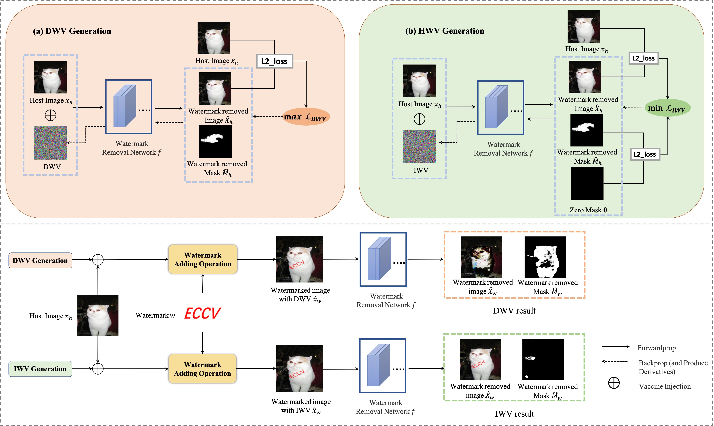
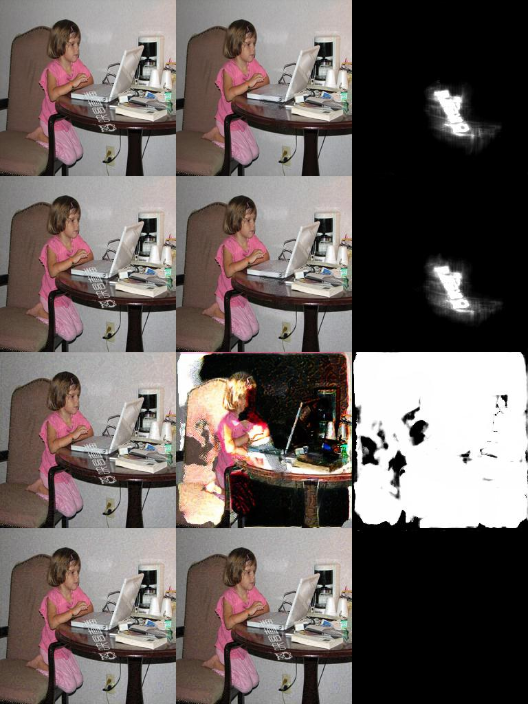
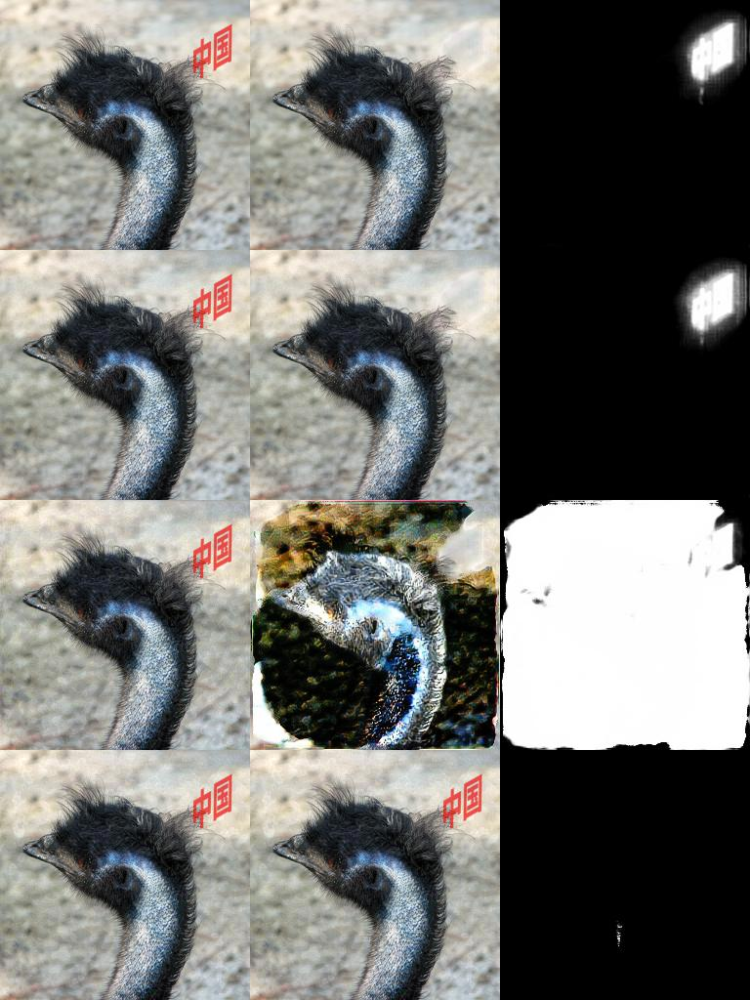

# Watermark Vaccine
The code for ECCV2022 (Watermark Vaccine: Adversarial Attacks to Prevent Watermark Removal)

## Introduction
- The code is the implementation of the paper Watermark Vaccine: Adversarial Attacks to Prevent Watermark Removal.
- This paper has been received by ECCV 2020.



## Requirements


To install requirements:

## Pre-trained Models & Dataset
- We use the [CLWD](https://drive.google.com/file/d/17y1gkUhIV6rZJg1gMG-gzVMnH27fm4Ij/view) 
 (Colored Large-scale Watermark Dataset) in our experiments, which contains three parts: watermark-free images, watermarks and watermarked images. We first pretrain the watermark-removal networks using watermarked images in the train set of CLWD. Then in the attack stage, we use the watermark-free images as host images to generate watermark vaccines, and then add the watermarks with generated watermark vaccines.
- You can download pretrained models here: [WDNet](https://drive.google.com/drive/folders/1UYOtWmYZQQmCPMLVrstVxhPYW4Jngo-g)

## Demo (WDNet as an example)
```eval
python demo.py --model WDNet  --epsilon 8 --start_epsilon 8 --step_alpha 2 --seed 160 --num_img 20 --attack_iter 50
```

## Results
- The first column is the input, the second is the output, and the last column is the predicted mask.
- First row is the clean image as an input, second row is the random noise input, last two rows are DWV and IWV respectively.






## Acknowledgement
This work builds on many excellent works, which include:

[WatermarkRemoval-WDNet-WACV2021](https://github.com/MRUIL/WDNet)

[deep-blind-watermark-removal](https://github.com/vinthony/deep-blind-watermark-removal)

[Visual Motif Removal](https://github.com/amirhertz/visual_motif_removal)